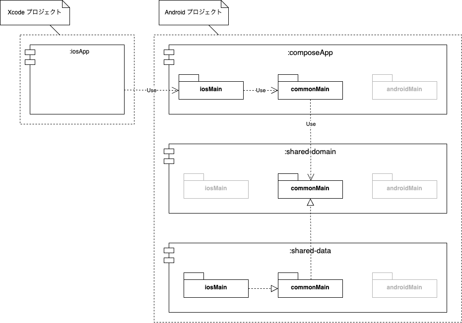
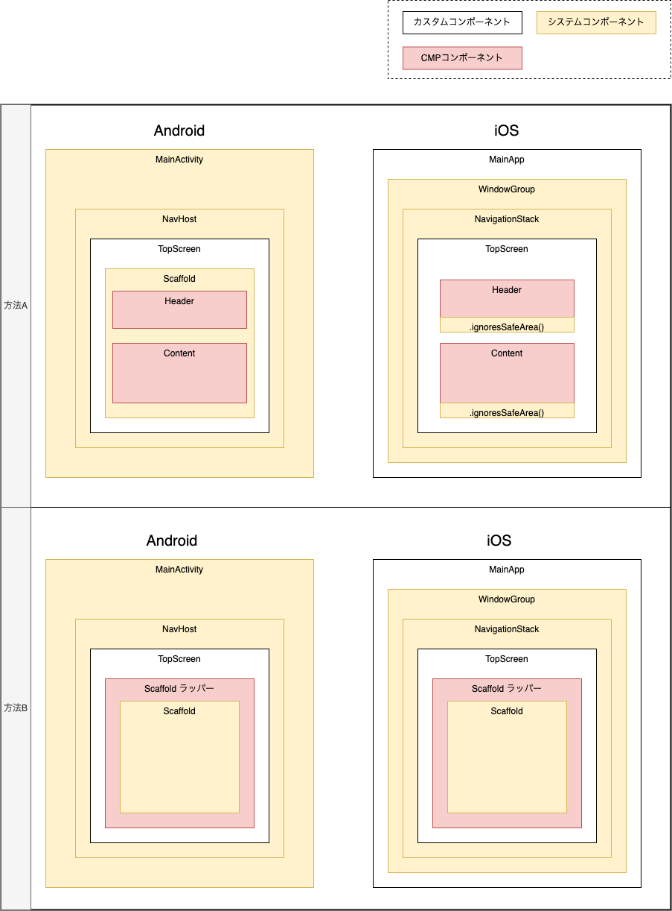

### モジュール構成

Compose Multiplatform フレームワークの構成。

<div align="center">
  
</div>

### UI 構成

Compose Multiplatform による UI の共通化は Android と iOS の画面のコンテンツ部分に限定する。

方法１と方法２のどちらかを採用。  
ex. TopScreen は方法１、ViewerScreen は方法２

<div align="center">
  
</div>

### Build and Run Android Application

To build and run the development version of the Android app, use the run configuration from the run widget
in your IDE’s toolbar or build it directly from the terminal:
- on macOS/Linux
  ```shell
  ./gradlew :composeApp:assembleDebug
  ```
- on Windows
  ```shell
  .\gradlew.bat :composeApp:assembleDebug
  ```

### Build and Run iOS Application

To build and run the development version of the iOS app, use the run configuration from the run widget
in your IDE’s toolbar or open the [/iosApp](./iosApp) directory in Xcode and run it from there.

