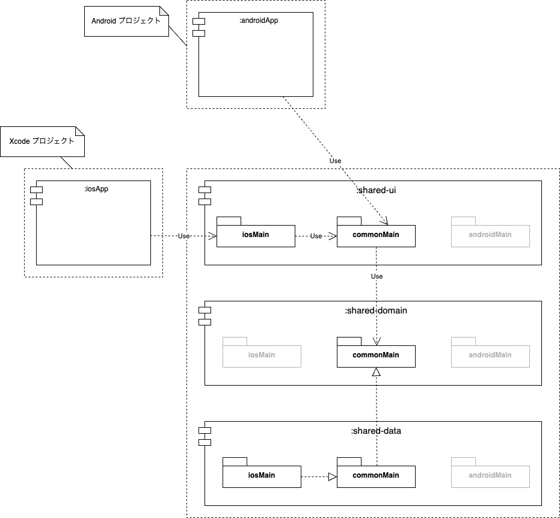
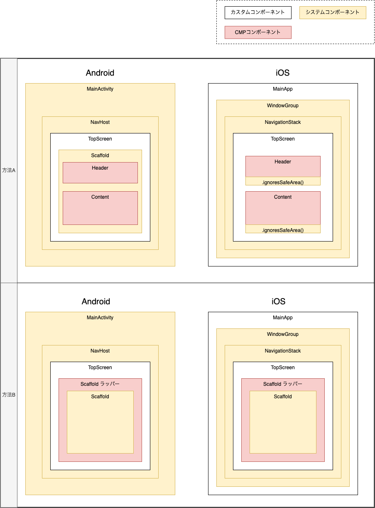

# ネイティブ、CMP ハイブリッド PDF Viewer

既存の Android / iOS ネイティブアプリに Compose Multiplatform を段階的に導入し、UI を共通化していく手法を検証するサンプルプロジェクト。サンプル機能として PDF ビューアーを実装している。

### モジュール構成

Compose Multiplatform フレームワークの構成。

<div align="center">
  
</div>

### UI 構成

本プロジェクトにおける Compose Multiplatform による UI の共通化は画面または画面のコンテンツ部分に限定する。以下の３つの共通化方法を用いる。 

| 方法 |                    | Android   | iOS         |共通化範囲 |例      |
|------|--------------------|-----------|-------------|---------|--------|
| A    |Scaffold の部品であるヘッダーとコンテンツを CMP で共通化する。|ネイティブ側に Screen コンポーザブル関数と Scaffold を配置して CMP の ヘッダーとコンテンツ を呼び出す。   |ネイティブ側に View protocol を実装した Screen  struct と VStack 等を配置して CMP の ヘッダーとコンテンツ を呼び出す。   |小 |TopScreen | 
| B    |Scaffold のラッパーを CMP で共通化する。|ネイティブ側に Screen コンポーザブル関数を配置し、CMP の Scaffold ラッパーを呼び出す。   |ネイティブ側に View protocol を実装した Screen  struct を配置して Scaffold ラッパーを呼び出す。  |中 |InformationScreen |
| C    |Scaffold のラッパーを CMP で共通化し、ラッパーを画面とする。|ネイティブ側に画面コンポーザブル関数を配置せず、CMP の Scaffold ラッパーを画面として使用する。  |ネイティブ側に View protocol を実装した Screen  struct を配置せず、CMP の Scaffold ラッパーを画面として使用する。   |大 |ViewerScreen(ViewerScaffoldComposeView) |


<div align="center">
  
</div>

### ナビゲーション

Android のナビゲーションには Jetpack Navigation Compose を使用し、[skydoves/compose-navy-graph](https://github.com/skydoves/compose-navy-graph) プラグインを適用している。

各画面に以下のアノテーションを付与することで、IDE の **NavGraph Graph** パネルに画面遷移グラフとプレビューを表示できる。

| アノテーション | 用途 |
|---|---|
| `@NavGraphRoot` | ナビゲーションのルート画面（`TopScreen`）に付与 |
| `@NavDestination(route = Screen.Xxx::class)` | ナビゲーションの遷移先画面に付与 |
| `@NavEdge(to = Screen.Xxx::class)` | 画面間の遷移エッジを定義 |
| `@NavPreview(route = Screen.Xxx::class, primary = true)` | 各画面のプレビュー関数に付与し、NavGraph Previews にサムネイルを表示 |

ルート定義は `shared-ui/src/commonMain/.../navigation/Screen.kt` に配置している。

### Android アプリのビルドと実行

Android アプリの開発版をビルド・実行するには、IDE ツールバーの実行ウィジェットから実行構成を使用するか、ターミナルから直接ビルドする。

- macOS / Linux
  ```shell
  ./gradlew :composeApp:assembleDebug
  ```
- Windows
  ```shell
  .\gradlew.bat :composeApp:assembleDebug
  ```

### iOS アプリのビルドと実行

iOS アプリの開発版をビルド・実行するには、IDE ツールバーの実行ウィジェットから実行構成を使用するか、[/iosApp](./iosApp) ディレクトリを Xcode で開いて実行する。

---

### 既知の問題とワークアラウンド

#### CMP リソースが Android APK に含まれない問題

**影響バージョン**: AGP 9.2.1 + CMP 1.11.1

**症状**: `stringResource()` を使う Composable に遷移すると以下の例外でクラッシュする。

```
MissingResourceException: Missing resource with path:
  composeResources/{package}.generated.resources/values/strings.commonMain.cvr
```

**原因**: `shared-ui` モジュールが使用する `com.android.kotlin.multiplatform.library` プラグインは AGP 9.x で導入された KMP 専用の Android ライブラリプラグインである。CMP の `CopyResourcesToAndroidAssetsTask` は従来の `com.android.library` プラグインの assets ディレクトリ API を前提としており、新しいプラグインに対応していないため `outputDirectory` が設定されず、`composeResources/` 以下の CVR ファイルが AAR・APK に含まれない。

**ワークアラウンド**: 以下の2ファイルで回避している。

| ファイル | 内容 |
|---|---|
| `shared-ui/build.gradle.kts` | `assembleAndroidMainComposeResources` タスクを追加し、`commonMain` の prepared resources を package prefix 付きで assembled ディレクトリへコピーする |
| `androidApp/build.gradle.kts` | `android.sourceSets["main"].assets.srcDirs` で生成ディレクトリを追加し、`mergeDebugAssets` / `mergeReleaseAssets` が `assembleAndroidMainComposeResources` の後に実行されるよう依存を宣言する |

**解除条件**: 以下のコマンドが `BUILD SUCCESSFUL` で完了したら、両ファイルの `[ワークアラウンド]` コメントが付いたブロックを削除できる。

```shell
./gradlew :shared-ui:copyAndroidMainComposeResourcesToAndroidAssets
```

CMP または AGP のいずれかが対応することで解決する見込み。

